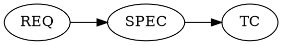

# Links, Labels and Item Creation

Matrix is designed such that items of a particular Category may link to other items of some particular Categories.
For example, a Requirement should link to a Specification. A Specification to a Test, and a Test to an Executed Test.
We call this [Traceability](https://docs23.matrixreq.com/usv23/traceability-rules) in the documentation.

You can explore the traceability rules for a project with the `ItemConfiguration` class. Let's focus on which categories link to each other, and create/edit some links between them. Here I've compiled the information into a drawing showing those categories which have downlinks: 

```js title="relationships.js"
--8<-- "./codes/relationships.js"
```

The output, processed with GraphViz:



## Altering Downlinks in one Item

Let's write a program that finds a random SPEC item which links to a TC. We'll remove the TC link and ensure that our now-changed
item doesn't show up in the original query for SPECs which link to TCs. Then we'll put things back as we found them.
This demonstrates making changes that affect the server.

```js title="change-downlink.js"
--8<-- "./codes/change-downlink.js"
```

This program is rather large because of the need to carefully set things back.

```bash
mstanton@darkstar:~/work/matrix-sdk-docs/codes (main)$ node change-downlink
Debugger attached.
Found 4 SPEC Items that have TC downlinks. Choosing SPEC-11 at random.
SPEC-11 linked to TC-4
Item updated...re-running search query..
Success changing and restoring SPEC-11.
Waiting for the debugger to disconnect...
mstanton@darkstar:~/work/matrix-sdk-docs/codes (main)$
```
