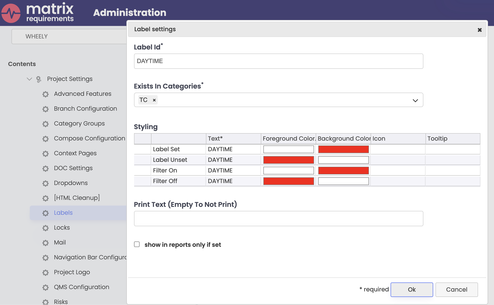
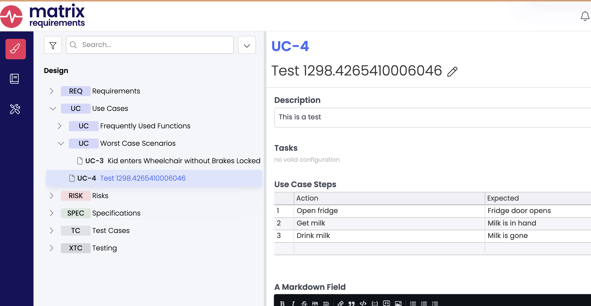
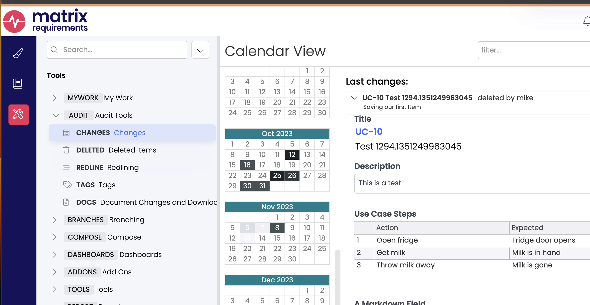
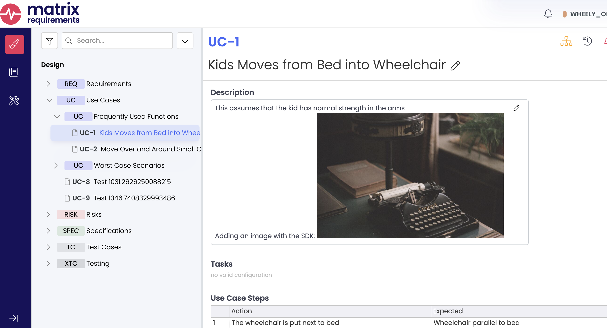
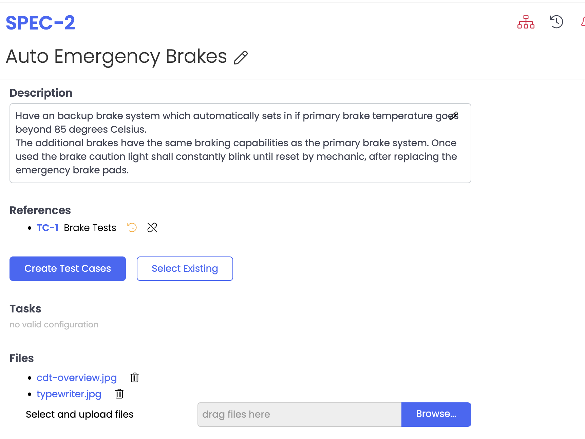

# Links, Labels and Item Creation

Matrix is designed such that items of a particular Category may link to other items of some particular Categories.
For example, a Requirement should link to a Specification. A Specification to a Test, and a Test to an Executed Test.
We call this [Traceability](https://docs23.matrixreq.com/usv23/traceability-rules) in the documentation.

You can explore the traceability rules for a project with the `ItemConfiguration` class. Let's focus on which categories link to each other, and create/edit some links between them. Here I've compiled the information into a drawing showing those categories which have downlinks: 

```js title="relationships.js"
--8<-- "./codes/relationships.js"
```

You'll see I also added a method to our library to return the server and project, `lib.getServerAndProject(connection, projectName)`,
with appropriate default values for my server.

The output, processed with GraphViz:


## Altering Downlinks in one Item

Let's write a program that finds a random SPEC item which links to a TC. We'll remove the TC link and ensure that our now-changed
item doesn't show up in the original query for SPECs which link to TCs. Then we'll put things back as we found them.
This demonstrates making changes that affect the server.

```js linenums="1" title="change-downlink.js"
--8<-- "./codes/change-downlink.js"
```

Note **line 21** where we save our changes to the server. `Project.updateItem()` returns a fresh copy of the item.
Running the application gives the following output:

```bash
mstanton@darkstar:~/work/matrix-sdk-docs/codes (main)$ node change-downlink
Debugger attached.
Found 4 SPEC Items that have TC downlinks. Choosing SPEC-11 at random.
SPEC-11 linked to TC-4
Item updated...re-running search query..
Success changing and restoring SPEC-11.
Waiting for the debugger to disconnect...
mstanton@darkstar:~/work/matrix-sdk-docs/codes (main)$
```

## Labels

Labels in Matrix are quite sophisticated. In the WHEELY_CLIENT_TESTS project, there is an "XOR" label with two values:

* DAYTIME
* NIGHTTIME

If one of these labels is set on an Item, then the other is set, the first label will be removed. The client enforces the label rules.
Additionally, labels can be limited to particular categories. Let's try and set the DAYTIME label on a REQ.

```js title="bad-set-label.js"
--8<-- "./codes/bad-set-label.js"
```

Looking at the output, we've been rebuked!

```bash
mstanton@darkstar:~/work/matrix-sdk-docs/codes (main)$ node bad-set-label
/Users/mstanton/work/matrix-sdk-docs/codes/node_modules/matrix-requirements-sdk/server/index.js:8535
                throw new Error(`Category ${this.type} doesn't allow labels`);
                      ^

Error: Category REQ doesn't allow labels
    at Item.verifyLabelsAllowed (/Users/mstanton/work/matrix-sdk-docs/codes/node_modules/matrix-requirements-sdk/server/index.js:8535:23)
    at Item.setLabel (/Users/mstanton/work/matrix-sdk-docs/codes/node_modules/matrix-requirements-sdk/server/index.js:8559:14)
    at run (/Users/mstanton/work/matrix-sdk-docs/codes/bad-set-label.js:9:9)
    at process.processTicksAndRejections (node:internal/process/task_queues:95:5)

Node.js v18.11.0
mstanton@darkstar:~/work/matrix-sdk-docs/codes (main)$ 
```

Note that the exception was thrown on the call to `Item.setLabel()`, and no trip to the server was made. This is because the
SDK has the label configuration locally, and can enforce those rules. Looking at the Label settings, we see that this label only
works on TC Items:



Let's retrieve an existing TC Item and do some experiments. We've also got "OR" labels "ORANGE" and "APPLE" in our Label configuration.

```js title="set-labels.js"
--8<-- "./codes/set-labels.js"
```

Running the code above, we get:

```bash
mstanton@darkstar:~/work/matrix-sdk-docs/codes (main)$ node set-labels
TC-1: Initial state
  Labels: ORANGE, NIGHTTIME, FORPRINTING
TC-1: After set of DAYTIME (xor label)
  Labels: ORANGE, FORPRINTING, DAYTIME
TC-1: After set of NIGHTTIME (xor label)
  Labels: ORANGE, FORPRINTING, NIGHTTIME
TC-1: After set of APPLE and ORANGE (or labels)
  Labels: ORANGE, FORPRINTING, NIGHTTIME, APPLE
TC-1: After unset of DAYTIME (should have no effect)
  Labels: ORANGE, FORPRINTING, NIGHTTIME, APPLE
TC-1: Labels set to empty
  Labels: 
TC-1 is dirty, not saving to the server
mstanton@darkstar:~/work/matrix-sdk-docs/codes (main)$ 
```

Note that the DAYTIME label was removed when we set NIGHTTIME. Whereas the APPLE and ORANGE
labels should not toggle on or off as we set one or the other. They are "OR" labels, not "XOR" labels.

## Item creation

The SDK is designed to support you in creating new Items. Generally, no trip to the server is necessary during
construction of an Item. Once the Project configuration is locally available, Fields and Labels can be set
in a validated way, as demonstrated above with Labels.

The important methods for creating and saving Items are on the **Project**.

* `Project.createItem(category: string): Item` - No trip to the server is made. An Item with no Id is returned.
* `Project.putItem(folderId: string, item: Item): Promise<Item>` - Save an Item with no Id to the server.
* `Project.updateItem(item: Item): Promise<Item>` - update an existing Item.
* `Project.deleteItem(itemId: string, force?: boolean)` - Force must be true if the Item is a FOLDER with children.

Let's create a UC (Use Case) object. There is a *steplist* Field type called "Use Case Steps". It will be
interesting to see how you add rows to a table:

```js title="create-uc.js"
--8<-- "./codes/create-uc.js"
```

Running gives the output `Created Item UC-4` on my server, with the following screenshot:



It turns out the milk is spoiled! We can change "Drink milk" in the 3rd row of the table like so:

```js
    const columnName = tableHandler.columnNumberToFieldId(0);
    tableHandler.setColumnData(2, columnName, "Throw milk away");
    // Be sure to update the server!
```

Let's make a program that does all of that then deletes the Item, so we don't leave our database a mess.

```js title="create-uc-cleanup.js"
--8<-- "./codes/create-uc-cleanup.js"
```

After running that, you can look at the changes made on your Matrix Project, and you'll see the delete
mentioned at the top:



## Uploading image attachments

A *Richtext* Field can display images.
When we upload an attachment to the server, we're given back information we
can turn into a URL to retrieve the image from the server again. Let's just try uploading an image
and printing the URL returned by the server. We need the [**Axios**](https://www.npmjs.com/package/axios) library to do this.
To load **Axios** into your project, run the following at the command prompt:

```bash
npm install axios
```

Below, we pass the Axios library to `Project.uploadLocalFile()` as the first parameter.
We also need to create stream for the file on line 10.

```js linenums="1" title="upload-image.js"
--8<-- "./codes/upload-image.js"
```

You'll see output like this:

```bash
mstanton@darkstar:~/work/matrix-sdk-docs/codes (main)$ node upload-image
Uploading...
Uploading...
Visit https://clouds5.matrixreq.com/rest/1/WHEELY_OBSERVABLE/file/11075?key=key_elnjk70etp7p1qadc5vuqss634 to get your file
mstanton@darkstar:~/work/matrix-sdk-docs/codes (main)$ 
```

Note that we're getting the image with `https`, but it is possible to get it without authentication. Just change
the protocol to `http`. You can alter this on your Matrix server, such that all images require authentication.

To add an uploaded image to a Richtext field, simply reference the URL in an html `img` tag, like so:

```js linenums="1" title="place-image.js"
--8<-- "./codes/place-image.js"
```

Running at the command prompt reveals:

```bash
mstanton@darkstar:~/work/matrix-sdk-docs/codes (main)$ node place-image
Uploading...
Uploading...
Added image to UC-1
```

Which looks like this in the Matrix application:



## File Attachments

You can also upload attachments to be stored by `fileManager` fields. I've added
a `fileManager` field to category SPEC, and attached a file. Our FieldHandler
for the `fileManager` field type is bare-bones, only providing the `getData()` and
`setData(string)` methods that every FieldHandler provides. We'll have to examine the
data format in order to work with it correctly.

```js title="get-attachments.js"
--8<-- "./codes/get-attachments.js"
```

The code above prints out the JSON object it expects in the `fileManager` field:

```bash
mstanton@darkstar:~/work/matrix-sdk-docs/codes (main)$ node get-attachments
[
  {
    fileName: 'cdt-overview.jpg',
    fileId: '11085?key=key_fb77i3bti07cku2dp1f7lcglib'
  }
]
mstanton@darkstar:~/work/matrix-sdk-docs/codes (main)$ 
```

The data format of the field is an array of `{fileName, fileId}` tuples, where
`fileId` is a concatenation of two fields in the [AddFileAck](reference/interfaces/serverSdk.AddFileAck.html)
structure returned by `Project.uploadLocalFile()` and `Project.uploadFile()`, `fileId` and `key`.

Let's try our hand at uploading a second file and saving it:

```js title="upload-file-manager.js"
--8<-- "./codes/upload-file-manager.js"
```

Running at the command prompt, we get:

```bash
mstanton@darkstar:~/work/matrix-sdk-docs/codes (main)$ node upload-file-manager
Uploaded /Users/mstanton/work/matrix-sdk-docs/codes/resources/typewriter.jpg to
 https://clouds5.matrixreq.com/rest/1/WHEELY_OBSERVABLE/file/11088?key=key_r8ovlj5cf9d1o53t5qfhli9p9r
[
  {
    fileName: 'cdt-overview.jpg',
    fileId: '11085?key=key_fb77i3bti07cku2dp1f7lcglib'
  },
  {
    fileName: 'typewriter.jpg',
    fileId: '11088?key=key_r8ovlj5cf9d1o53t5qfhli9p9r'
  }
]
Updated SPEC-2
mstanton@darkstar:~/work/matrix-sdk-docs/codes (main)$ 
```

Looking at SPEC-2 in the Matrix application, we can see we've got two attachments that
can be downloaded:



We hope you enjoy using the SDK to solve problems. Beyond this guide, the [FAQ](zee-faq.md) and
[Reference documentation](ref.md) may be helpful.
