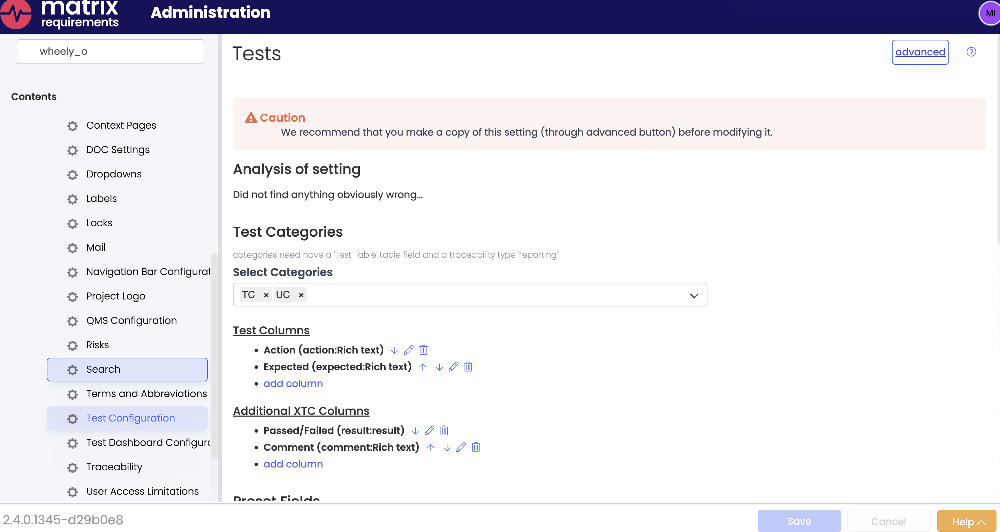
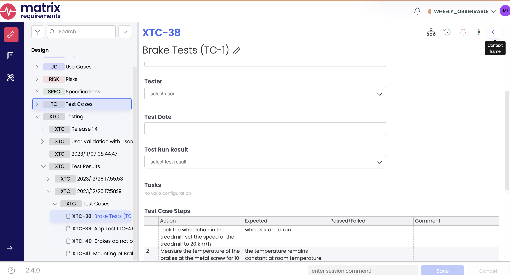
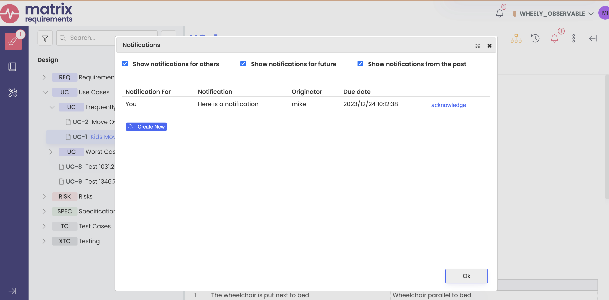

# FAQ

The SDK is brand new so there are plenty of things we haven't thought about yet.
This FAQ contains answers to questions you're likely to have at some point.

## What about saving server settings?

This is easy with [`Server.getServerSettings()`](https://matrixrequirements.github.io/matrix-sdk-docs/reference/classes/serverSdk.StandaloneMatrixSDK.html#getServerSettings),
as demonstrated in the program below:

```js title="server-setting.js"
--8<- "./codes/server-setting.js"
```

Note that we get a `favorites` setting, and create a simple object with our favorite things
in it if the setting doesn't exist yet. Here are two runs of the program:

```bash
mstanton@darkstar:~/work/matrix-sdk-docs/codes (main)$ node server-setting.js
Saved favorites
{ car: 'Mustang', food: 'Tacos', music: 'Post-rock' }
mstanton@darkstar:~/work/matrix-sdk-docs/codes (main)$ node server-setting.js
Found existing favorites
{ car: 'Mustang', food: 'Tacos', music: 'Post-rock' }
```

## How do I create test cases (XTC Items)?

XTC Items are created by a server-side process from a collection of source items (usually 
TC (Test Cases), but it depends on your configuration). You can do this from the SDK by calling
[`Project.execute()`](reference/classes/serverSdk.Project.html#execute) and passing
an [`ExecuteParam`](reference/interfaces/serverSdk.ExecuteParam.html) structure
giving the source objects and output folder for the newly-created XTC items.

Normally, the `ExecuteParam` structure is populated with defaults from the Project
Test Configuration, which you can set up in the Administration panel here:



Because this is usually what you want to use as a source for creating XTCs, we have a
convenience method [`Project.createExecuteParamWithDefaults()`](reference/classes/serverSdk.Project.html#createExecuteParamWithDefaults) to fill in the mapping from source item fields to
target (XTC) fields. The code below creates a folder "Test Results" if it doesn't exist,
then kicks off creation of XTCs with `Project.execute()`:

```js title="execute-call.js"
--8<- "./codes/execute-call.js"
```

Here is the console output after a run, showing the structure of the `ExecuteParam` object
created for the call to `execute()`, along with the Id of the folder with the new XTCs:

```bash
mstanton@darkstar:~/work/matrix-sdk-docs/codes (main)$ node execute-call
{
  input: [ 'F-TC-1' ],
  output: 'XTC',
  reason: 'Create XTCs 1599.5004580020905',
  itemFieldMapping: [
    { fromId: 37379, toId: 37383 },
    { fromId: 37380, toId: 37388 },
    { fromId: 37381, toId: 37389 },
    { fromId: 37382, toId: 37390 },
    { fromId: 37365, toId: 37383 },
    { fromId: 37366, toId: 37388 },
    { fromId: 37367, toId: 37389 },
    { fromId: 37368, toId: 37390 }
  ],
  parentFolder: 'F-XTC-59'
}
Created folder F-XTC-62
mstanton@darkstar:~/work/matrix-sdk-docs/codes (main)$
```

And here is the state of the project after running two times:

;

Note the Folder named "Test Results" which we've made serve as the parent folder for
generating a set of XTCs.

## How do I deal with DOC objects?

To be done...

## How do I run a server hook?

A hook is a server-side job with a unique name that accepts an Item Id and a
payload string. Method [`runHook()`](reference/classes/serverSdk.Project.html#runHook) on
the [`Project`](reference/classes/serverSdk.Project.html) class kicks off the
hook. Some hooks return a jobId which can be polled for a result at job completion.
[`Project.waitOnJobCompletion()`](reference/classes/serverSdk.Project.html#waitOnJobCompletion)
makes it easy to do that. Example code:

```js
...
const result = await project.runHook(reqs[0], "publish_marketplace", "");
const jobId = JSON.parse(result).jobId;
const jobResult = await project.waitOnJobCompletion(jsonResult.jobId, (jid, progress) => {
    console.log(`${jid}: progress ${progress}`);
});
console.log(`Final result: ${jobResult.length} generated files`);
if (jobResult.length > 0) {
    console.dir(jobResult[0], { depth: null, colors: true });
}
```

And output:

```bash
mstanton@darkstar:~/work/hook-test$ node hook-example
4783: progress 10
4783: progress 10
4783: progress 10
4783: progress 100
Final result: 1 generated files
{
  restUrl: 'https://clouds5.matrixreq.com/rest/1/WHEELY_OBSERVABLE/job/4783/7250',
  jobFileId: 7250,
  visibleName: 'publishlog.txt',
  internalPath: '/generated/j4783_publishlog.txt',
  mimeType: 'text/plain'
}
mstanton@darkstar:~/work/hook-test$
```

## Why do I have to load the Axios library separately?

Currently, we're shipping the Server SDK as a rollup of all our dependencies.
For Node this is not ideal, and we plan to load dependencies from the Node
environment in a future release. Axios is required for just one call,
[`Project.uploadLocalFile()`](reference/classes/serverSdk.Project.html#uploadLocalFile)
so we prefered not to bundle it.

## Can I create Notifications with the SDK?

Yes, as long as [the feature is enabled on the server](https://docs23.matrixreq.com/usv23/notifications-settings). The `Item` class includes two methods for manipulating "Todos," another name for notifications:

* [createTodo(users, type, text, atDate)](reference/classes/serverSdk.Item.html#createTodo) - create a Todo for multiple users and return ids. The `type` field is a string from the [`TodoTypes` enum](reference/enums/serverSdk.TodoTypes.html)
* [getTodos(includeDone, includeAllUsers, includeFuture)](reference/classes/serverSdk.Item.html#getTodos) - return information on Todos active for this item

Additionally, [`Project.getTodos()`](reference/classes/serverSdk.Project.html#getTodos) returns information
on all Todos active in the Project. Let's create two Todos and verify that they can be found from the
`Project`` class:

```js title="todos.js"
--8<- "./codes/todos.js"
```

The returned structure includes all Todos in the project, as well as a summary report of the active
Todos for the current user. My API Token is attached to my user account which is `mike`, so we see that
Mike has 1 Todo:

```bash
mstanton@darkstar:~/work/matrix-sdk-docs/codes (main)$ node todos
Created Todos 382, 383
{
  todos: [
    {
      todoId: 383,
      userId: 7,
      login: 'francois',
      projectShort: 'WHEELY_OBSERVABLE',
      itemRef: 'UC-2',
      auto: false,
      originatorUserId: 23,
      originatorLogin: 'mike',
      action: [Object],
      createdAt: '2023-12-24T10:12:38.458Z',
      createdAtUserFormat: '2023/12/24 10:12:38',
      future: false
    },
    {
      todoId: 382,
      userId: 23,
      login: 'mike',
      projectShort: 'WHEELY_OBSERVABLE',
      itemRef: 'UC-1',
      auto: false,
      originatorUserId: 23,
      originatorLogin: 'mike',
      action: [Object],
      createdAt: '2023-12-24T10:12:38.352Z',
      createdAtUserFormat: '2023/12/24 10:12:38',
      future: false
    }
  ],
  todoCounts: [
    {
      userId: 23,
      login: 'mike',
      projectId: 360,
      projectShort: 'WHEELY_OBSERVABLE',
      nbTodos: 1,
      firstTodos: [Array]
    }
  ]
}
mstanton@darkstar:~/work/matrix-sdk-docs/codes (main)$ 
```

If I log in as `mike`, I can see the newly created Todo:



The Matrix server resists creating too many similar Todos. So if the user, date and
description are the same as an existing Todo, a new Todo won't be created (-1 will be returned as the
Todo Id).