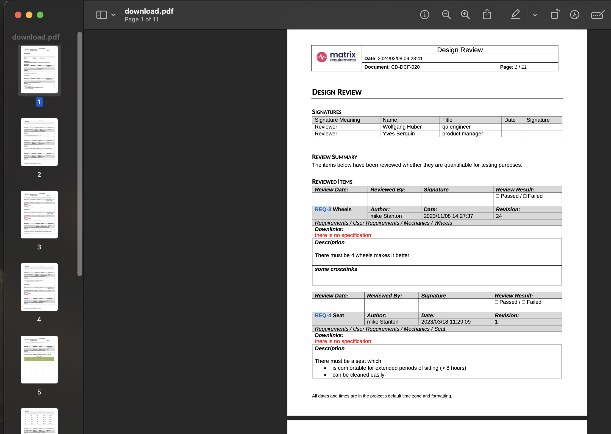

# FAQ

The SDK is brand new so there are plenty of things we haven't thought about yet.
This FAQ contains answers to questions you're likely to have at some point.

## Why do I need to set comments?
Whenever you change an item with the SDK, you need to set a comment first. This is achieved using the function 
[`server.setComment("My comment")`](https://matrixrequirements.github.io/matrix-sdk-docs/reference/classes/serverSdk.StandaloneMatrixSDK.html#setComment)
If not set, the udpdate call will return a 403 error code. 


## What about saving server settings?

This is easy with [`Server.getServerSettings()`](https://matrixrequirements.github.io/matrix-sdk-docs/reference/classes/serverSdk.StandaloneMatrixSDK.html#getServerSettings),
as demonstrated in the program below:

```js title="server-setting.js"
--8<- "./codes/server-setting.js"
```

Note that we get a `favorites` setting, and create a simple object with our favorite things
in it if the setting doesn't exist yet. Here are two runs of the program:

```bash
mstanton@darkstar:~/work/matrix-sdk-docs/codes (main)$ node server-setting.js
Saved favorites
{ car: 'Mustang', food: 'Tacos', music: 'Post-rock' }
mstanton@darkstar:~/work/matrix-sdk-docs/codes (main)$ node server-setting.js
Found existing favorites
{ car: 'Mustang', food: 'Tacos', music: 'Post-rock' }
```

## How do I create test cases (XTC Items)?

XTC Items are created by a server-side process from a collection of source items (usually 
TC (Test Cases), but it depends on your configuration). You can do this from the SDK by calling
[`Project.execute()`](reference/classes/serverSdk.Project.html#execute) and passing
an [`ExecuteParam`](reference/interfaces/serverSdk.ExecuteParam.html) structure
giving the source objects and output folder for the newly-created XTC items.

Normally, the `ExecuteParam` structure is populated with defaults from the Project
Test Configuration, which you can set up in the Administration panel here:


Because this is usually what you want to use as a source for creating XTCs, we have a
convenience method [`Project.createExecuteParamWithDefaults()`](reference/classes/serverSdk.Project.html#createExecuteParamWithDefaults) to fill in the mapping from source item fields to
target (XTC) fields. The code below creates a folder "Test Results" if it doesn't exist,
then kicks off creation of XTCs with `Project.execute()`:

```js title="execute-call.js"
--8<- "./codes/execute-call.js"
```

Here is the console output after a run, showing the structure of the `ExecuteParam` object
created for the call to `execute()`, along with the Id of the folder with the new XTCs:

```bash
mstanton@darkstar:~/work/matrix-sdk-docs/codes (main)$ node execute-call
{
  input: [ 'F-TC-1' ],
  output: 'XTC',
  reason: 'Create XTCs 1599.5004580020905',
  itemFieldMapping: [
    { fromId: 37379, toId: 37383 },
    { fromId: 37380, toId: 37388 },
    { fromId: 37381, toId: 37389 },
    { fromId: 37382, toId: 37390 },
    { fromId: 37365, toId: 37383 },
    { fromId: 37366, toId: 37388 },
    { fromId: 37367, toId: 37389 },
    { fromId: 37368, toId: 37390 }
  ],
  parentFolder: 'F-XTC-59'
}
Created folder F-XTC-62
mstanton@darkstar:~/work/matrix-sdk-docs/codes (main)$
```

And here is the state of the project after running two times:

;

Note the Folder named "Test Results" which we've made serve as the parent folder for
generating a set of XTCs.

## How do I deal with DOC objects?

A DOC is like a unique, stand-alone [`Item`](reference/classes/serverSdk.Item.html)
[`Category`](reference/classes/serverSdk.Category.html). The DOC describes the fields that it contains,
configures the fields, and includes the content for the fields. This makes it a more complex
object to work with than an ordinary Item, where configuration is done at the Category level.

With that in mind, we've provided the [`DocItem`](reference/classes/serverSdk.DocItem.html) class, which
has all the features of the Item class with some extra helper methods. First, let's bring down
an existing DOC and explore it with the DocItem class. In the `WHEELY_OBSERVABLE` Project
we've got `DOC-8` which is a Design Review. It has a signature field, a summary rich text
field and a queried list of reviewed items that show up when the document is rendered.

Rather than calling `getFields()`, you should call `getInnerDHFFields()` on a `DocItem`.
This is because at its core, the DOC is the same as any other Item, and has a set of Fields,
however, the names of the fields are of the form "dhf01", "dhf02", and so on. Looking at the UI,
you see much more useful names like "Signatures" and "Review Summary." Method `getInnerDHFFields()`
allows you to use those human-readable names and see the configuration for the fields easily too.

Let's list the field names in the DOC:

```js title="get-doc-8.js"
--8<-- "codes/get-doc-8.js"
```

Which gives the following output, showing the user-readable field names and the field types:

```bash
Fields in DOC-8:
"Signatures" [signaturebox]
"Review Summary" [richtext]
"Reviewed Items" [items]
```

`IDocFieldHandler` offers the following methods in addition to what `IFieldHandler` provides:

```typescript
export interface IDocFieldHandler extends IFieldHandler{
    dhfFieldConfig: IAnyMap;

    setDHFConfig(config:IAnyMap):void;
    getDefaultConfig():any;
    getXmlValue():string;

    getFieldName(): string;
    setFieldName(value: string): void;
    addSignatures (signatures: string[], includeAll?:boolean): void;
}
```

We can print the field configuration as a JSON object, and the field data (string or JSON object).

```js title="get-doc-8-moredetail.js"
--8<-- "codes/get-doc-8-moredetail.js"
```

Which gives the following output, showing the user-readable field names and the field types:

```bash
Fields in DOC-8:
"Signatures" [signaturebox]
  {
    columns: [
      {
        name: 'Signature Meaning',
        field: 'col0',
        columnType: 'type6',
        pos: 0
      },
      { name: 'Name', field: 'col1', columnType: 'type4', pos: 1 },
      { name: 'Title', field: 'col2', columnType: 'type0', pos: 2 },
      { name: 'Date', field: 'col3', columnType: 'type5', pos: 3 },
      { name: 'Signature', field: 'col4', columnType: 'type3', pos: 4 }
    ]
  }
  [
    { col0: 'Reviewer', col1: 'wolfgang', col2: 'qa engineer' },
    { col0: 'Reviewer', col1: 'yves', col2: 'product manager' }
  ]
"Review Summary" [richtext]
  { page_break: false }
  The items below have been reviewed whether they are quantifiable for testing purposes.
"Reviewed Items" [items]
  {
    breadcrumb: true,
    extracolumn: '',
    showlinks: true,
    page_break: false,
    folderDetails: '',
    showUpOnly: false,
    showDownOnly: false,
    showDeeplinks: false,
    showExternal: 0,
    dateoptions: '',
    refdocs: false,
    hideLinkErrors: false,
    hideLabels: false,
    showAllParentFolders: false,
    hideEmptyFolders: false,
    includeInToc: false,
    breakAfterItems: false
  }
  [ { to: 'F-REQ-1', title: 'Requirements' } ]
```

To render and download a DOC as a PDF, you can call `toPDF()` and `downloadJobResult()`:

```js title="get-doc-8-pdf.js"
--8<-- "codes/get-doc-8-pdf.js"
```

We can render a DOC as PDF, Word or HTML. The program saves the PDF render to disk where it can
be opened with any PDF file reader:

```bash
darkstar:~/matrix-sdk-docs/codes $ node get-doc-8-pdf.js
Progress: 10%
Progress: 40%
Progress: 40%
Progress: 40%
Progress: 90%
Progress: 91%
Progress: 91%
Progress: 100%
Downloading Job 4853 File 7393 as download.pdf...
```

;

## How do I run a server hook?

A hook is a server-side job with a unique name that accepts an Item Id and a
payload string. Method [`runHook()`](reference/classes/serverSdk.Project.html#runHook) on
the [`Project`](reference/classes/serverSdk.Project.html) class kicks off the
hook. Some hooks return a jobId which can be polled for a result at job completion.
[`Project.waitOnJobCompletion()`](reference/classes/serverSdk.Project.html#waitOnJobCompletion)
makes it easy to do that. Example code:

```js
...
const result = await project.runHook(reqs[0], "publish_marketplace", "");
const jobId = JSON.parse(result).jobId;
const jobResult = await project.waitOnJobCompletion(jsonResult.jobId, (jid, progress) => {
    console.log(`${jid}: progress ${progress}`);
});
console.log(`Final result: ${jobResult.length} generated files`);
if (jobResult.length > 0) {
    console.dir(jobResult[0], { depth: null, colors: true });
}
```

And output:

```bash
mstanton@darkstar:~/work/hook-test$ node hook-example
4783: progress 10
4783: progress 10
4783: progress 10
4783: progress 100
Final result: 1 generated files
{
  restUrl: 'https://clouds5.matrixreq.com/rest/1/WHEELY_OBSERVABLE/job/4783/7250',
  jobFileId: 7250,
  visibleName: 'publishlog.txt',
  internalPath: '/generated/j4783_publishlog.txt',
  mimeType: 'text/plain'
}
mstanton@darkstar:~/work/hook-test$
```

## Why do I have to load the Axios library separately?

Currently, we're shipping the Server SDK as a rollup of all our dependencies.
For Node this is not ideal, and we plan to load dependencies from the Node
environment in a future release. Axios is required for just one call,
[`Project.uploadLocalFile()`](reference/classes/serverSdk.Project.html#uploadLocalFile)
so we prefered not to bundle it.

## Can I create Notifications with the SDK?

Yes, as long as [the feature is enabled on the server](https://docs23.matrixreq.com/usv23/notifications-settings). The `Item` class includes two methods for manipulating "Todos," another name for notifications:

* [createTodo(users, type, text, atDate)](reference/classes/serverSdk.Item.html#createTodo) - create a Todo for multiple users and return ids. The `type` field is a string from the [`TodoTypes` enum](reference/enums/serverSdk.TodoTypes.html)
* [getTodos(includeDone, includeAllUsers, includeFuture)](reference/classes/serverSdk.Item.html#getTodos) - return information on Todos active for this item

Additionally, [`Project.getTodos()`](reference/classes/serverSdk.Project.html#getTodos) returns information
on all Todos active in the Project. Let's create two Todos and verify that they can be found from the
`Project`` class:

```js title="todos.js"
--8<- "./codes/todos.js"
```

The returned structure includes all Todos in the project, as well as a summary report of the active
Todos for the current user. My API Token is attached to my user account which is `mike`, so we see that
Mike has 1 Todo:

```bash
mstanton@darkstar:~/work/matrix-sdk-docs/codes (main)$ node todos
Created Todos 382, 383
{
  todos: [
    {
      todoId: 383,
      userId: 7,
      login: 'francois',
      projectShort: 'WHEELY_OBSERVABLE',
      itemRef: 'UC-2',
      auto: false,
      originatorUserId: 23,
      originatorLogin: 'mike',
      action: [Object],
      createdAt: '2023-12-24T10:12:38.458Z',
      createdAtUserFormat: '2023/12/24 10:12:38',
      future: false
    },
    {
      todoId: 382,
      userId: 23,
      login: 'mike',
      projectShort: 'WHEELY_OBSERVABLE',
      itemRef: 'UC-1',
      auto: false,
      originatorUserId: 23,
      originatorLogin: 'mike',
      action: [Object],
      createdAt: '2023-12-24T10:12:38.352Z',
      createdAtUserFormat: '2023/12/24 10:12:38',
      future: false
    }
  ],
  todoCounts: [
    {
      userId: 23,
      login: 'mike',
      projectId: 360,
      projectShort: 'WHEELY_OBSERVABLE',
      nbTodos: 1,
      firstTodos: [Array]
    }
  ]
}
mstanton@darkstar:~/work/matrix-sdk-docs/codes (main)$ 
```

If I log in as `mike`, I can see the newly created Todo:


The Matrix server resists creating too many similar Todos. So if the user, date and
description are the same as an existing Todo, a new Todo won't be created (-1 will be returned as the
Todo Id).
